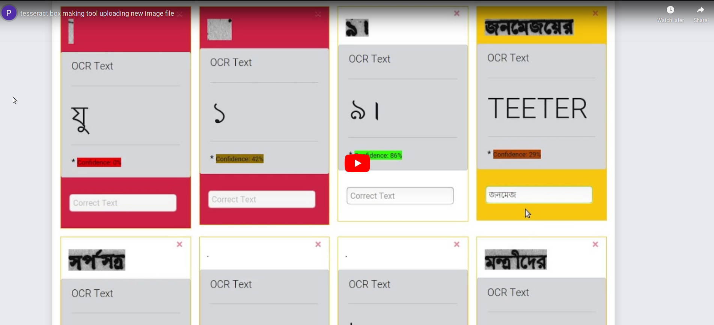
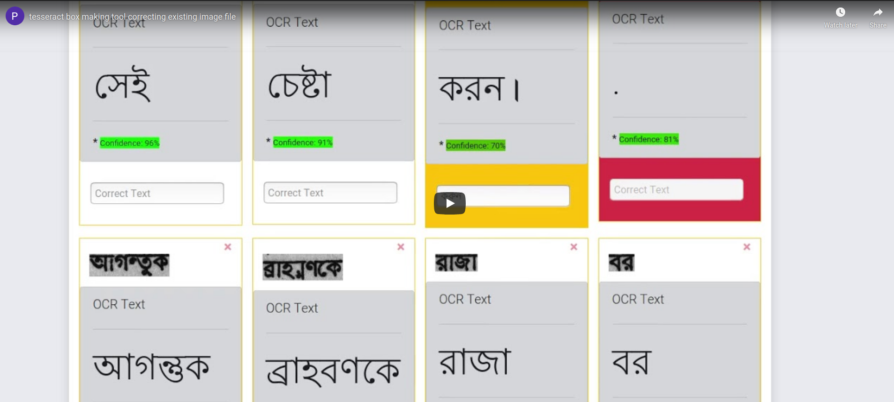

# Introduction
This is a tool for creating box files for Tesseract OCR from Bangla images. You would be able to edit images which show incorrect text and feed it to the backend system for correction. The box file is generated with corrected text. This is still work in progress.

# Demo

## Upload a new image
This demo will show you how you can upload a new image containing Bangla to the backend system, and how it detects words using OCR and then sends it to the frontend so that you can manually correct the words, or remove mis-detected words.

## Correct an existing image
This demo will show you how you can retrieve an image that you had uploaded in the past and correct it.

# Developer Stuff

## Running the project

This project is written in React. You can run it by:

    npm start

Open [http://localhost:3000](http://localhost:3000) to view it in the browser.

## Bangla typing
1. <https://github.com/dipu-bd/jquery.bangla>    
1. <https://medium.com/@dipu.sudipta/jquery-bangla-an-input-tool-for-bangla-language-cc3bd781b2d8>

## Fix for common problems
### Error: ENOSPC: System limit for number of file watchers reached, watch 'box-making-tool-web/public'
This happens when you have the Visual Studio Open. Solution:

    export CHOKIDAR_USEPOLLING=1

## Production Build
### Basic Commands

The command for production build is:
    
    npm run build

This builds the app for production to the `build` folder. 
It correctly bundles React in production mode and optimizes the build for the best performance.

The build is minified and the filenames include the hashes. 
Your app is ready to be deployed!

See the section about [deployment](https://facebook.github.io/create-react-app/docs/deployment) for more information.

### Dockerisation

    docker build -t box-making-tool-web:v0.1 .
    docker run -it --rm -p 3000:80 box-making-tool-web:v0.1

## Google Integration
1. Integrate Google sign-in: <https://developers.google.com/identity/sign-in/web/sign-in>
1. Google sign-in React component: <https://www.npmjs.com/package/react-google-login>
