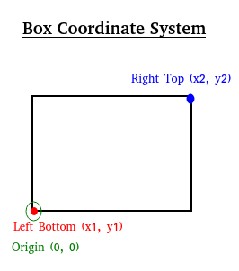
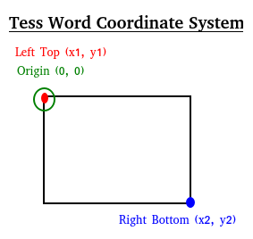

# Training Tesseract (LSTM) For Bengali
## Building Tesseract Training Tools
While building Tesseract from source, we need to build training tools as well.

    make training
    make training-training
    make ScrollView.jar

Then, manually copy the  __java__  folder to the *TESSERACT_HOME*. Define the below environment variable:

    export SCROLLVIEW_PATH=$TESSERACT_HOME/java

You would also need to copy the contents of <https://github.com/tesseract-ocr/tessconfigs/tree/master/configs> under *$TESSDATA_PREFIX*.   

The best trained LSTM models can be found here: <https://github.com/tesseract-ocr/tessdata_best>  

Download the *langdata* as well from: <https://github.com/tesseract-ocr/langdata_lstm>

## Creating Box Files
Creating *box files* is the first step. Box file is a *plain-text* file that is used to specify the text, or a character, at a given coordinate in the image. For the *lstm* system, the coordinates of an entire line is considered and *NOT* the individual coordinates of the character in the image. Note that, this is significantly different from the earlier *Tesseract 3.x*, where the coordinates of that character was needed. The format of the box file is:

    <character> <LeftBottom x1> <LeftBottom y1> <RightTop x2> <RightTop y2> <tiff image page number>
   
The coordinate system used in the box file has **(0,0)** at the **bottom-left** as shown below:



Contrast it with Tesseract Word Coordinates below:



In a box file, every end of a word is marked with:

    <space> <LeftBottom x1> <LeftBottom y1> <RightTop x2> <RightTop y2> <tiff image page number>
    
Similarly, every end of a line is marked with:

    <tab> <LeftBottom x1> <LeftBottom y1> <RightTop x2> <RightTop y2> <tiff image page number>        

### Basic Command

The below command will generate a box file called my-box-file.box from an image:

    tesseract -l ben bangla-mahabharat-1-page_2.jpg my-box-file lstmbox
    
### Online Documentation
1. <https://tesseract-ocr.github.io/tessdoc/TrainingTesseract-4.00.html#making-box-files>
1. <https://github.com/tesseract-ocr/tesseract/issues/2357#issuecomment-477239316>    
    
## Training Tesseract 4.x from existing model

### From tiff/box pairs

#### Step 1: Extract recognition model

A recognition model can be extracted from an existing *traineddata* file. The output of this would be a *lstm* file.
    
    combine_tessdata -e /kaaj/installs/tesseract/tessdata_best-4.0.0/eng.traineddata ./eng.lstm

#### Step 2: Creating lstmf file from a tiff/box pair

We would need to obtain a *lstmf* binary file from a *tiff* image and its corresponding *box* file. The below command will create a *lstmf* binary file, given a *tiff* and *box* file pair:

    tesseract eng.DejaVu_Math_TeX_Gyre.exp0.tif eng.DejaVu_Math_TeX_Gyre.exp0 --psm 6 lstm.train
    
You can create multiple *lstmf* files from several *tiff/box* pairs.    
    
#### Step 3: Creating a list of lstmf files

Create a *eng.training_files.txt* containing all the *lstmf* files that you have created in the previous step. The contents of this file will be the full path of each of the *lstmf* file as shown below:

```
/kaaj/source/porua/training/engtrain/eng.DejaVu_Math_TeX_Gyre.exp0.lstmf
```
#### Step 4: Run training command    

Then run the below command to train:

    lstmtraining --model_output ./my_output \
    --continue_from ./eng.lstm \
    --traineddata /kaaj/installs/tesseract/tessdata_best-4.0.0/eng.traineddata \
    --train_listfile ./eng.training_files.txt \
    --max_iterations 400    

### From a given font

The below command will generate a *lstmf* binary file from a list of texts and a given font:

    tesstrain.sh --fonts_dir /usr/share/fonts/truetype/dejavu --lang eng --linedata_only \
    --fontlist "DejaVu Math TeX Gyre" --noextract_font_properties --langdata_dir /kaaj/installs/tesseract/langdata \
    --tessdata_dir /kaaj/installs/tesseract/tessdata_best-4.0.0 --output_dir /kaaj/source/porua/training/engtrain
     
The above command internally does multiple steps to generate the lstmf file. 

For example, the below command generates a *tiff* image from a list of texts and a given font:

    text2image --fontconfig_tmpdir=./temp-fonts-dir --fonts_dir=/usr/share/fonts/truetype/dejavu  \
    --strip_unrenderable_words --leading=32 --xsize=3600 --char_spacing=0.0 --exposure=0  \
    --outputbase=eng.DejaVu_Math_TeX_Gyre.exp0 --max_pages=0 --font="DejaVu Math TeX Gyre"   \
    --ptsize 12 --text=/kaaj/installs/tesseract/langdata/eng/eng.training_text
    
The below command will then create a *traineddata* file:

    combine_lang_model --input_unicharset /kaaj/installs/tesseract/langdata_lstm-master/eng/eng.unicharset  \
    --script_dir /kaaj/installs/tesseract/langdata --words /kaaj/installs/tesseract/langdata_lstm-master/eng/eng.wordlist  \
    --numbers /kaaj/installs/tesseract/langdata_lstm-master/eng/eng.numbers  \
    --puncs /kaaj/installs/tesseract/langdata_lstm-master/eng/eng.punc  \
    --output_dir . --lang eng    
    
In the *fontconfig_tmpdir*, we would need a file called *fonts.conf* having contents:

```xml
<?xml version="1.0"?>
<!DOCTYPE fontconfig SYSTEM "fonts.dtd">
<fontconfig>
	<dir>/usr/share/fonts/truetype/dejavu</dir>
	<cachedir>/tmp/font_tmp.A6newLIaIu</cachedir>
	<config></config>
</fontconfig>
```

## Miscellaneous
### Tesseract API Guide
<https://tesseract-ocr.github.io/tessdoc/APIExample>
